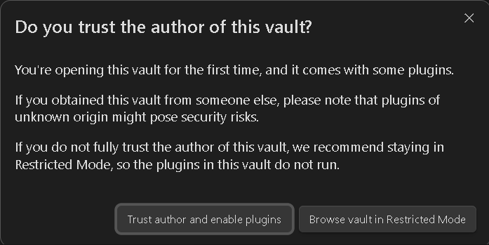

### Obsidian usage in a project

When a folder is opened as a Vault in Obsidian, a `.obsidian` folder is added to that folder in the project. The .obsidian folder is, by default, added to the .gitignore file. However, if we commit the .obsidian folder and all or some of its contents, we retain Obsidian settings for all users who clone the repo. 

### Obsidian plugins
If plugins are added to the Obsidian vault, a plugins folder is also added to the `.obsidian` folder. If included in the commit, those plugins are brought into Obsidian when the Vault is opened for the first time by a user who has cloned the repo. When the vault is opened the user is presented with the message below, if the user selects `Trust author and enable plugins`, the plugins are installed and enabled for that user.

Here is a list of files that can be added with/in the `.obsidian` folder and what they do:
1. `app.json`:
	Stores global settings for the Obsidian application, such as theme preferences and other UI settings.
2. `config.json`:
	Contains configuration settings specific to the vault, including hotkeys, appearance settings, and other customizations.
3. `plugins` folder:
	This folder contains subfolders for each installed plugin. Each plugin's folder includes its own configuration files and data.
4. `themes` folder:
	Stores custom themes that you can apply to your Obsidian vault. Each theme is typically a CSS file.
5. `workspace` file:
	Saves the current layout and state of your workspace, including open panes and their positions. This file changes whenever you open or close files in Obsidian.
6. `community-plugins.json`:
	Lists the community plugins you have installed and their settings.
7. `appearance.json`:
	Contains settings related to the appearance of your vault, such as the selected theme and font sizes.
8. `hotkeys.json`:
	Stores custom hotkey configurations for various commands and actions within Obsidian.
9. `core-plugins-migration.json`:
	Used to manage the migration of core plugins between different versions of Obsidian. This file helps ensure that any changes or updates to core plugins are properly applied when you upgrade to a new version of Obsidian. It keeps track of which plugins need to be enabled, disabled, or updated based on the version.
10. `core-plugins.json`:
	Used to manage the settings and states of the core plugins that come with Obsidian. This file keeps track of which core plugins are enabled or disabled and stores any specific configurations for these plugins. By maintaining this information, Obsidian ensures that your preferred setup for core plugins is preserved across sessions.